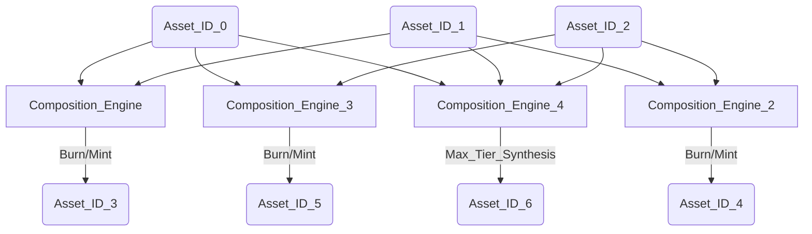

[](https://forge-tokens.vercel.app)


# ⚒️ Forge — Atomic Asset Composition on ERC-1155

A multi-tier ERC-1155 protocol on **Ethereum Sepolia**. Players mint base-layer tokens (IDs 0-2) under a per-address cooldown and combine them into higher-tier composites (IDs 3-6) via a single-transaction burn-and-mint. Logic and asset are split between [`Forge.sol`](be/src/Forge.sol) and [`FToken.sol`](be/src/FToken.sol): the `Forge` contract is the immutable owner of `FToken`, so all supply changes flow through one place.

---

## Quick Start

1. Open the **[live demo](https://forge-tokens.vercel.app)**.
2. Connect a wallet on **Ethereum Sepolia**.
3. **Mint basics** (IDs 0-2, 15-second cooldown per address) to assemble inputs.
4. **Forge composites** (IDs 3-6) by spending the right recipe, **trade** any token for a basic, or **burn** a forged token.

Need testnet ETH? [Sepolia Faucet](https://sepolia-faucet.pk910.de/)

---

## Features in Action

### Minting basic tokens (0-2)

Cooldown-gated mint of the base layer. Each call mints exactly one token.


### Trading any token for a basic

Burn one token to receive exactly one of token 0, 1, or 2 (cannot trade into the same id).


### Forging composites (3-6) via atomic burn-mint

`burnBatch` consumes the recipe and `mint` issues the composite, both in one transaction.


### Burning forged tokens

Only forged IDs (3-6) can be destroyed via `Forge.burn`; basic IDs are protected.


### Mobile experience

The same flows on a small viewport.


---

## Architecture

Two contracts, one ledger. `Forge` holds the rules; `FToken` holds the balances. Nothing else can mint or burn.

| Layer | Role |
|-------|------|
| [`Forge`](be/src/Forge.sol) | Game logic: mint (basic 0-2), forge (composite 3-6), burn (forged only), trade (any → basic), cooldown admin |
| [`FToken`](be/src/FToken.sol) | ERC-1155 asset ledger; `mint` / `burn` / `burnBatch` restricted to the owning `Forge` |

### Design and security

| Principle | Implementation |
|-----------|----------------|
| **Atomic composition** | For IDs 3-6, `mint` calls `burnBatch` then `mint` in one transaction — no half-updated balances. |
| **Checks-Effects-Interactions** | Basic mint updates `userCoolDownTimer` before the external `I_TOKEN.mint` call (see `Forge.mint` in [`be/src/Forge.sol`](be/src/Forge.sol)). |
| **State-gated minting (basic)** | `mapping(address => uint256) userCoolDownTimer` enforces a per-address cooldown (default **15s**, set in [`be/script/Forge_Constants.sol`](be/script/Forge_Constants.sol)). |
| **Access control** | `FToken.mint` / `burn` / `burnBatch` use `onlyOwner`; only the deployed `Forge` address can mutate supply. |
| **Restricted trade and burn** | `trade(burn, mint)` enforces `_tokenIdToBurn != _tokenIdToMint` and requires `_tokenIdToMint ∈ {0, 1, 2}`; `burn` rejects basic IDs so 0-2 cannot be destroyed outside the recipe path. |
| **Foundry tests** | Tests in [`be/test/`](be/test/) cover mint, forge, burn, trade, cooldowns, admin paths, and revert cases (100% coverage). |

### Event-driven UI

The frontend uses `watchContractEvent` over an Alchemy WebSocket to subscribe to `Forge__MintToken`, `Forge__ForgeToken`, `Forge__BurnToken`, and `Forge__Trade`, then invalidates per-token TanStack Query caches so balances and forgeability update in near real time without polling. See [`fe/app/_hooks/_events/use-mint-events.ts`](fe/app/_hooks/_events/use-mint-events.ts) and its siblings.

### Token catalog and recipes

Seven token IDs (0-6). Base layer **0-2** mints with cooldown; composite **3-6** require the exact burn recipe below.

| Token IDs | Type | Minting rule |
|-----------|------|--------------|
| 0, 1, 2 | Basic | Mint directly (15-second cooldown per address). |
| 3 | Forged | Burn 1× token 0 + 1× token 1. |
| 4 | Forged | Burn 1× token 1 + 1× token 2. |
| 5 | Forged | Burn 1× token 0 + 1× token 2. |
| 6 | Forged | Burn 1× token 0 + 1× token 1 + 1× token 2. |

### System design (asset evolution)



---

## Tech Stack

| Layer | Technologies |
|-------|--------------|
| Smart contracts | Solidity ^0.8.13, Foundry (build, test, script), OpenZeppelin (ERC-1155) |
| Frontend | Next.js 16 (App Router), React 19, TypeScript, Tailwind CSS 4, shadcn/ui (Radix), motion |
| Web3 client | wagmi v2, viem, RainbowKit, Alchemy RPC + WebSocket |
| State and forms | TanStack Query v5, React Context (token state), React Hook Form + Zod |
| Storage / metadata | IPFS base URI in [`be/script/Forge_Constants.sol`](be/script/Forge_Constants.sol) |
| Quality | Foundry tests (100% coverage), ESLint, GitHub Actions CI ([`.github/workflows/foundry-tests.yml`](.github/workflows/foundry-tests.yml)) |

---

## Test Metrics

100% across lines, statements, branches, and functions on both contracts and deploy scripts. CI runs `forge test -vvv` on every push and PR to `main`/`develop` ([`.github/workflows/foundry-tests.yml`](.github/workflows/foundry-tests.yml)).

```bash
cd be && forge install
cd be && forge test --gas-report
cd be && forge coverage
```

<details>
  <summary><strong>View coverage report (100%)</strong></summary>

| File                          | Lines            | Statements       | Branches         | Funcs            |
| ----------------------------- | ---------------- | ---------------- | ---------------- | ---------------- |
| **script/FTokenScript.s.sol** | 100% (6/6)       | 100% (5/5)       | 100% (0/0)       | 100% (1/1)       |
| **script/ForgeScript.s.sol**  | 100% (6/6)       | 100% (5/5)       | 100% (0/0)       | 100% (1/1)       |
| **src/FToken.sol**            | 100% (16/16)     | 100% (11/11)     | 100% (1/1)       | 100% (7/7)       |
| **src/Forge.sol**             | 100% (67/67)     | 100% (78/78)     | 100% (18/18)     | 100% (8/8)       |
| **Total**                     | **100% (95/95)** | **100% (99/99)** | **100% (19/19)** | **100% (17/17)** |

</details>

---

## Setup (Deployment and Verification)

### Deployed addresses (Sepolia)

| Contract | Address |
|----------|---------|
| Forge | [`0xd4922b783f762feb81ceb08d6f1f4c45a8caa148`](https://sepolia.etherscan.io/address/0xd4922b783f762feb81ceb08d6f1f4c45a8caa148#code) *(verified)* |
| FToken (ERC-1155) | [`0x8281b01D35A70BDc17D85c6df3d45B67745a5F9f`](https://sepolia.etherscan.io/address/0x8281b01D35A70BDc17D85c6df3d45B67745a5F9f#code) *(verified)* |

### Clone

```bash
git clone git@github.com:SiegfriedBz/Forge-DApp.git
```

### Contracts

Deployment constants (`TOKEN_URI`, `MAX_TOKEN_ID`, `COOL_DOWN_DELAY`) live in [`be/script/Forge_Constants.sol`](be/script/Forge_Constants.sol).

Create `be/.env`:

```bash
ALCHEMY_SEPOLIA_RPC_URL=
ETHERSCAN_API_KEY=
PRIVATE_KEY=
```

Deploy and verify (`ForgeScript` deploys `Forge`, which constructs `FToken` automatically — no separate `FTokenScript` deploy needed):

```bash
cd be
forge script script/ForgeScript.s.sol \
  --rpc-url $ALCHEMY_SEPOLIA_RPC_URL \
  --broadcast \
  --verify
```

### Frontend

Create `fe/.env`:

```bash
NEXT_PUBLIC_ETH_SEPOLIA_ALCHEMY_HTTP_URL=
NEXT_PUBLIC_ETH_SEPOLIA_ALCHEMY_WS_URL=
NEXT_PUBLIC_WALLETCONNECT_PROJECT_ID=
```

After deploying, sync ABIs and addresses in [`fe/app/_contracts/`](fe/app/_contracts/) from your broadcast output, then:

```bash
cd fe
pnpm install
pnpm dev
```

---

## Future Roadmap

- **L2 convergence.** Deploy to Arbitrum or Base to compare gas cost on the `burnBatch + mint` paths against Sepolia.
- **Per-token cooldowns.** Extend the global `coolDownDelay` into per-id and progressive cooldowns to allow finer control over each token's supply curve.
- **Marketplace integration.** Plug `FToken` into a generic ERC-1155 marketplace so secondary trading complements the in-protocol `trade` (basic-only).

---

## Author

**Siegfried Bozza** · M.Sc / M.Eng · Full-stack Web3 engineer.

_Forge_ was built solo, alongside a full-time full-stack job (frontend, contracts, tests, deployment).

- [LinkedIn](https://www.linkedin.com/in/siegfriedbozza/)
- [GitHub](https://github.com/SiegfriedBz)
