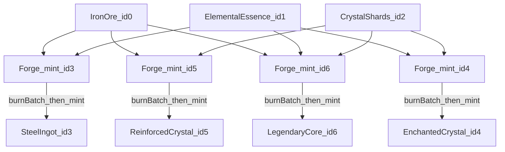

[](https://forge-tokens.vercel.app)


# Forge — A Web3 Token-Composition Case Study

Forge is an **Ethereum Sepolia** DApp built around **ERC-1155** crafting: mint three base materials (token IDs **0–2**) under a per-address cooldown, **forge** composites (**3–6**) with a single-transaction **burn-then-mint**, optionally **trade** any held id back into a basic, or **burn** forged ids only. Rules live in [`Forge.sol`](be/src/Forge.sol); balances live in [`FToken.sol`](be/src/FToken.sol), which only the deployed `Forge` can mint or burn.

---

## Why

ERC-1155 is a practical standard when one contract needs to represent many fungible and semi-fungible ids. A natural follow-up question is how to keep **composition rules** and **supply mutations** honest when recipes get non-trivial: who is allowed to mint, and how do you avoid half-applied state when burning inputs and minting outputs?

Forge is an experiment in that direction. It keeps the **ledger** (`FToken`) supply-focused and the **rules** (`Forge`) explicit: every supply change routes through `Forge`, which encodes cooldowns, recipes, trade constraints, and burn permissions. The UI is a **single-page** app so contracts and UI stay easy to read, reason about, and test together.

---

## Try the Live Demo

1. Open the **[live demo](https://forge-tokens.vercel.app)**.
2. Connect a wallet on **Ethereum Sepolia**.
3. **Mint basics** (IDs 0–2, **15-second** cooldown per address) to assemble inputs.
4. **Forge composites** (IDs 3–6) by spending the right recipe, **trade** any token for exactly one basic (0, 1, or 2), or **burn** a forged token (3–6 only).

Need testnet ETH? [Sepolia Faucet](https://sepolia-faucet.pk910.de/)

---

## Features in Action

### Minting basic tokens (0–2)

Cooldown-gated mint of the base layer. Each call mints exactly one token.


### Trading any token for a basic

Burn one token to receive exactly one of token 0, 1, or 2 (cannot trade into the same id).


### Forging composites (3–6) via atomic burn-mint

`burnBatch` consumes the recipe and `mint` issues the composite, both in one transaction.


### Burning forged tokens

Only forged IDs (3–6) can be destroyed via `Forge.burn`; basic IDs are protected.


### Mobile experience

The same flows on narrow and mobile viewports.


---

## How It Works

Two contracts, one ledger: **`Forge`** encodes behavior; **`FToken`** stores ERC-1155 balances. Only `Forge` (as immutable owner of `FToken`) can call `mint`, `burn`, or `burnBatch` on the token contract.

| Component | Role |
|-----------|------|
| [`Forge`](be/src/Forge.sol) | Mint basics (0–2), forge composites (3–6), burn forged only, trade (any id → one basic), owner-only cooldown tuning |
| [`FToken`](be/src/FToken.sol) | ERC-1155 ledger; supply mutations restricted to the owning `Forge` |

### Design choices

| Topic | What the code does |
|-------|---------------------|
| **Atomic forging** | For IDs 3–6, `Forge.mint` calls `I_TOKEN.burnBatch` then `I_TOKEN.mint` in one transaction so balances do not end up half-updated on success paths. |
| **Cooldown (basics)** | `mapping(address => uint256) userCoolDownTimer` gates mints for ids 0–2. Default delay is **15 seconds** in [`be/script/Forge_Constants.sol`](be/script/Forge_Constants.sol). |
| **Access control** | `FToken` uses `onlyOwner` on `mint` / `burn` / `burnBatch`; in the intended deployment, owner is `Forge`. |
| **Trade and burn rules** | `trade` requires `_tokenIdToBurn != _tokenIdToMint` and `_tokenIdToMint ∈ {0,1,2}`. `burn` rejects basic ids so 0–2 are not destroyed via that path. |
| **Tests** | Foundry tests under [`be/test/`](be/test/) cover mint, forge, burn, trade, cooldowns, admin paths, and revert cases. |

### Event-driven UI

The app uses `watchContractEvent` (wagmi core) over an **Alchemy WebSocket** transport ([`fe/app/_config/wagmi.ts`](fe/app/_config/wagmi.ts)) to subscribe to all four `Forge` events and invalidate per-token TanStack Query keys without polling:

- `Forge__MintToken` — invalidates the minted token's balance and retriggers forgeability.
- `Forge__ForgeToken` — invalidates the forged token's balance and all burnt input balances, then retriggers forgeability.
- `Forge__BurnToken` — invalidates the burnt token's balance.
- `Forge__Trade` — invalidates both the burnt and minted token balances, then retriggers forgeability.

See [`fe/app/_hooks/_events/use-mint-events.ts`](fe/app/_hooks/_events/use-mint-events.ts) and the sibling hooks in the same folder.

### Token catalog and recipes

Seven token IDs (0–6). Base layer **0–2** mint with cooldown; composite **3–6** require the exact burn recipe below (names match the UI copy in [`fe/app/_data/tokens.ts`](fe/app/_data/tokens.ts)).

| Token IDs | Name (UI) | Rule |
|-----------|-----------|------|
| 0, 1, 2 | Iron Ore, Elemental Essence, Crystal Shards | Mint via `Forge.mint` (15s cooldown per address, one token per call). |
| 3 | Steel Ingot | Burn 1×0 + 1×1. |
| 4 | Enchanted Crystal | Burn 1×1 + 1×2. |
| 5 | Reinforced Crystal | Burn 1×0 + 1×2. |
| 6 | Legendary Core | Burn 1×0 + 1×1 + 1×2. |

### Forging flow



---

## Testing

Smart-contract tests live under [`be/test/`](be/test/) (`ForgeTest.t.sol`, `FTokenTest.t.sol`) and run with Foundry. The suite is **37 tests** covering deployment, basic mint + cooldown, all forge recipes, insufficient-balance reverts, burn/trade rules, `getForgeData`, and owner-only `setCoolDownDelay`.

Tests require **two environment variables**: `MY_ADDRESS` (asserted against `Forge.I_OWNER()` / `FToken.I_OWNER()`) and `PRIVATE_KEY` (used by `ForgeScript` / `FTokenScript` inside `setUp`). Both must be set or the suite will not build. CI injects them from GitHub secrets; locally, either export your deployer key pair or use Foundry's default Anvil pair (`MY_ADDRESS=0xf39Fd6e51aad88F6F4ce6aB8827279cffFb92266`, `PRIVATE_KEY=0xac0974bec39a17e36ba4a6b4d238ff944bacb478cbed5efcae784d7bf4f2ff80`) for a quick run.

**Coverage (local):** `forge coverage` reports **100%** lines, statements, branches, and functions on the project-owned contracts and deploy scripts (see table below). **CI** runs `forge test -vvv` on every push and PR to `main` / `develop` — it does **not** run `forge coverage` automatically ([`.github/workflows/foundry-tests.yml`](.github/workflows/foundry-tests.yml)).

```bash
cd be && forge install
cd be && forge test --gas-report
cd be && forge coverage
```

<details>
  <summary><strong>View coverage report (100%)</strong></summary>

| File                          | Lines            | Statements       | Branches         | Funcs            |
| ----------------------------- | ---------------- | ---------------- | ---------------- | ---------------- |
| **script/FTokenScript.s.sol** | 100% (6/6)       | 100% (5/5)       | 100% (0/0)       | 100% (1/1)       |
| **script/ForgeScript.s.sol**  | 100% (6/6)       | 100% (5/5)       | 100% (0/0)       | 100% (1/1)       |
| **src/FToken.sol**            | 100% (16/16)     | 100% (11/11)     | 100% (1/1)       | 100% (7/7)       |
| **src/Forge.sol**             | 100% (67/67)     | 100% (78/78)     | 100% (18/18)     | 100% (8/8)       |
| **Total**                     | **100% (95/95)** | **100% (99/99)** | **100% (19/19)** | **100% (17/17)** |

</details>

---

## Tech Stack

| Layer | Technologies |
|-------|--------------|
| Smart contracts | Solidity ^0.8.13, Foundry (build, test, script), OpenZeppelin ERC-1155 |
| Frontend | Next.js 16 (App Router), React 19, TypeScript, Tailwind CSS 4, shadcn/ui (Radix) |
| Web3 client | wagmi v2, viem, RainbowKit, Alchemy HTTP + WebSocket |
| State and forms | TanStack Query v5, React Context ([`fe/app/_context/tokens-provider.tsx`](fe/app/_context/tokens-provider.tsx)), React Hook Form + Zod |
| Metadata | IPFS base URI in [`be/script/Forge_Constants.sol`](be/script/Forge_Constants.sol); local metadata files named `0`–`6` (no extension, JSON content) under [`ipfs-data/metadata/`](ipfs-data/metadata/) |
| Quality | Foundry tests (100% coverage locally), ESLint, GitHub Actions |

---

## Setup (deploy and run locally)

### Deployed addresses (Sepolia) — matches the live frontend

These are the addresses wired into [`fe/app/_contracts/forge-contract-config.ts`](fe/app/_contracts/forge-contract-config.ts) and [`fe/app/_contracts/ftoken-contract-config.ts`](fe/app/_contracts/ftoken-contract-config.ts). After a new deploy, update those files (and this table) so the hosted app and docs stay aligned.

| Contract | Address |
|----------|---------|
| Forge | [`0x7d8A16168D337B2241fCbA1cc5bd196479DF1F0C`](https://sepolia.etherscan.io/address/0x7d8A16168D337B2241fCbA1cc5bd196479DF1F0C#code) |
| FToken (ERC-1155) | [`0xa6D68eDA0993364481C2c5DA8d6cd43e03f592bA`](https://sepolia.etherscan.io/address/0xa6D68eDA0993364481C2c5DA8d6cd43e03f592bA#code) |

### Clone

```bash
git clone git@github.com:SiegfriedBz/Forge-DApp.git
```

### Contracts

Deployment constants (`TOKEN_URI`, `MAX_TOKEN_ID`, `COOL_DOWN_DELAY`) live in [`be/script/Forge_Constants.sol`](be/script/Forge_Constants.sol).

Create `be/.env`:

```bash
ALCHEMY_SEPOLIA_RPC_URL=
ETHERSCAN_API_KEY=
PRIVATE_KEY=
```

Deploy and verify (`ForgeScript` deploys `Forge`, which constructs `FToken` — no separate `FTokenScript` needed for the main app path):

```bash
cd be
forge script script/ForgeScript.s.sol \
  --rpc-url $ALCHEMY_SEPOLIA_RPC_URL \
  --broadcast \
  --verify
```

### Frontend

Create `fe/.env` (see [`fe/.env.example`](fe/.env.example)):

```bash
NEXT_PUBLIC_ETH_SEPOLIA_ALCHEMY_HTTP_URL=
NEXT_PUBLIC_ETH_SEPOLIA_ALCHEMY_WS_URL=
NEXT_PUBLIC_WALLETCONNECT_PROJECT_ID=
```

After deploying, sync ABIs and addresses in [`fe/app/_contracts/`](fe/app/_contracts/) from your broadcast output, then:

```bash
cd fe
pnpm install
pnpm dev
```

---

## Possible extensions

- **L2 deployment comparison** — Deploy the same `Forge`/`FToken` pattern to an L2 testnet and compare gas on `burnBatch` + `mint` paths vs Sepolia.
- **Per-token or progressive cooldowns** — Replace the single `coolDownDelay` with per-id tuning if you want different issuance curves for each basic.
- **Secondary marketplace** — Integrate standard ERC-1155 marketplace flows alongside the on-chain `trade` helper (which only mints basics).

---

## Author

**Siegfried Bozza** · M.Sc / M.Eng · Full-stack engineer & Web3 builder.

Forge was built solo, alongside a full-time full-stack role (frontend, contracts, tests, deployment).

[LinkedIn](https://www.linkedin.com/in/siegfriedbozza/)
