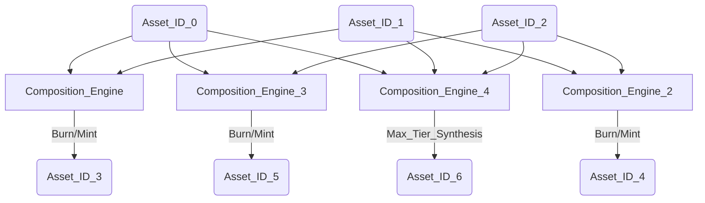

[](https://forge-tokens.vercel.app)


# ⚒️  Forge: Atomic Asset Composition & State-Evolution Protocol

**Forge** is a high-integrity reference implementation of a multi-tier asset evolution system built on **ERC-1155**. It demonstrates complex on-chain state transitions where higher-tier assets are synthesized through the atomic burning of base-layer primitives (batch burn + mint in one transaction for forged IDs).

This project is a **rigor proof**: a fully tested Foundry suite, timed state locks (cooldowns) for basic mints, multi-token burn-and-mint cycles for forging, and a frontend that syncs to on-chain events in near real time.

> I built Forge to challenge myself with full-stack Web3: **Solidity** + **Foundry** for game logic, and **Next.js** + **Wagmi** for a production-style dApp with **real-time** chain updates.

---

## Architectural overview

| Layer | Role |
| ----- | ---- |
| **`Forge`** | Game logic: mint (basic), forge (composite), burn (forged only), trade (any → basic), cooldown admin |
| **`FToken`** | ERC-1155 asset ledger; mint/burn entry points restricted to the owning `Forge` contract |

On deploy, `Forge` constructs `FToken` and becomes its immutable owner, so all supply changes flow through `Forge`—a clear separation between **logic** and **asset**.

---

## Engineering rigor & security

| Principle | Implementation |
| --------- | -------------- |
| **Atomic composition** | For IDs 3–6, `mint` calls `burnBatch` then `mint` in one transaction—no half-updated balances. |
| **Checks-Effects-Interactions** | Basic mint updates `userCoolDownTimer` before the external `I_TOKEN.mint` call (see `Forge.mint` in [`be/src/Forge.sol`](be/src/Forge.sol)). |
| **State-gated minting (basic)** | `mapping(address => uint256) userCoolDownTimer` enforces a per-address cooldown (default **15s**, set in [`be/script/Forge_Constants.sol`](be/script/Forge_Constants.sol)). |
| **Access control** | `FToken.mint` / `burn` / `burnBatch` use `onlyOwner`; only the deployed `Forge` address can mutate supply. |
| **Exhaustive tests** | Foundry tests in [`be/test/`](be/test/) cover mint, forge, burn, trade, cooldowns, admin paths, and revert cases. |

---

## Coverage report (verifiable locally)

```bash
cd be && forge coverage
```

<details>
  <summary><strong>View coverage report (100%)</strong></summary>

| File                          | Lines            | Statements       | Branches         | Funcs            |
| ----------------------------- | ---------------- | ---------------- | ---------------- | ---------------- |
| **script/FTokenScript.s.sol** | 100% (6/6)       | 100% (5/5)       | 100% (0/0)       | 100% (1/1)       |
| **script/ForgeScript.s.sol**  | 100% (6/6)       | 100% (5/5)       | 100% (0/0)       | 100% (1/1)       |
| **src/FToken.sol**            | 100% (16/16)     | 100% (11/11)     | 100% (1/1)       | 100% (7/7)       |
| **src/Forge.sol**             | 100% (67/67)     | 100% (78/78)     | 100% (18/18)     | 100% (8/8)       |
| **Total**                     | **100% (95/95)** | **100% (99/99)** | **100% (19/19)** | **100% (17/17)** |

</details>

---

## System design (asset evolution)

Seven token IDs (0–6). Base layer **0–2** mints with cooldown; composite **3–6** require the exact burn recipe below.



---

## Quick start

1. **Demo:** [Live Demo](https://forge-tokens.vercel.app)
2. **Testnet ETH:** [Sepolia Faucet](https://sepolia-faucet.pk910.de/)
3. Connect a wallet and play: mint basics (0–2), forge (3–6), trade, or burn forged tokens.

---

## Main features

- On-chain token crafting (ERC-1155)
- Event-driven UI: Alchemy HTTP + WebSocket + Wagmi hooks (`useMintEvents`, `useForgeEvents`, `useBurnEvents`, `useTradeEvents`)
- Cooldown-based basic minting
- Wagmi + RainbowKit wallet UX
- Responsive layout (desktop + mobile)
- High Foundry coverage on contracts and deploy scripts (see table above)
- Sepolia deployment + Etherscan-verified contracts (addresses below)

---

## Demo previews

### Desktop gameplay

#### 1. Minting basic tokens


#### 2. Trading tokens


#### 3. Forging rare tokens


#### 4. Burning tokens


### Mobile preview

#### Minting on mobile


---

## Interface & event synchronization

The frontend under [`fe/`](fe/) uses **Next.js 16**, **TypeScript**, **TanStack Query**, and **Wagmi + Viem** with **Alchemy** RPC + WebSocket env vars for responsive refetches after mints, forges, burns, and trades.

| Flow | Behavior |
| ---- | -------- |
| **Synthesis (forging)** | Multi-ID `burnBatch` + single mint in one `Forge.mint` call for IDs 3–6 |
| **Rate-limited minting** | Per-user cooldown on basic mints (0–2) |
| **Trading** | Burn one token, mint one basic (0–2); same-ID trade blocked on-chain |
| **Burning** | Only forged IDs 3–6 via `Forge.burn` |

---

## Game rules

### 1. Token categories

| Token IDs | Type   | Minting rule |
| --------- | ------ | ------------ |
| 0, 1, 2   | Basic  | Mint directly (15 seconds cooldown). |
| 3, 4, 5, 6 | Forged | Burn specific basic tokens to mint. |

### 2. Minting rules

- **Basic tokens (0, 1, 2):**
  - **Cooldown:** 15 seconds per user.
  - **Limit:** 1 token per call.

- **Forged tokens (3, 4, 5, 6):**
  - **Token 3:** Burn 1× token 0 + 1× token 1.
  - **Token 4:** Burn 1× token 1 + 1× token 2.
  - **Token 5:** Burn 1× token 0 + 1× token 2.
  - **Token 6:** Burn 1× token 0 + 1× token 1 + 1× token 2.

### 3. Burning & trading rules

- Tokens 3–6 can be burned directly.
- **Trading:** burn any token to mint exactly one of token 0, 1, or 2.
- Cannot trade a token into itself.
- Only the **Forge** contract can mint or burn **FToken** supply.

---

## Tech stack

### Frontend

| Technology | Purpose |
| ---------- | ------- |
| Next.js 16 + TypeScript | App framework |
| Tailwind + shadcn/ui | Styling and components |
| Zod + React Hook Form | Forms and validation |
| React Context | Local UI / token state |
| TanStack Query | Server/async state and caching |
| Wagmi + Viem + RainbowKit | Wallets and contract writes |
| pnpm | Package manager |

### Backend / protocol

| Layer | Technologies |
| ----- | -------------- |
| Contracts | Solidity ^0.8.13, Foundry, OpenZeppelin (ERC-1155 + access-control primitives) for gas-optimized batch transfers |
| Testing | Foundry (`be/test/`) |
| Metadata | IPFS base URI in [`be/script/Forge_Constants.sol`](be/script/Forge_Constants.sol) |
| RPC | Alchemy Sepolia (HTTP + WS) via [`be/foundry.toml`](be/foundry.toml) and `fe` env |

---

## Contracts (Sepolia)

- **Forge:** [0xd4922b783f762feb81ceb08d6f1f4c45a8caa148](https://sepolia.etherscan.io/address/0xd4922b783f762feb81ceb08d6f1f4c45a8caa148#code) *(verified)*
- **FToken (ERC-1155):** [0x8281b01D35A70BDc17D85c6df3d45B67745a5F9f](https://sepolia.etherscan.io/address/0x8281b01D35A70BDc17D85c6df3d45B67745a5F9f#code) *(verified)*

---

## Setup & deployment

### Clone

```bash
git clone git@github.com:SiegfriedBz/Forge-DApp.git
```

### Backend (Foundry)

Deployment constants (`TOKEN_URI`, `MAX_TOKEN_ID`, `COOL_DOWN_DELAY`) live in [`be/script/Forge_Constants.sol`](be/script/Forge_Constants.sol).

Create `be/.env`:

```bash
ALCHEMY_SEPOLIA_RPC_URL=
ETHERSCAN_API_KEY=
PRIVATE_KEY=
```

Deploy and verify:

```bash
cd be
forge script script/ForgeScript.s.sol \
  --rpc-url $ALCHEMY_SEPOLIA_RPC_URL \
  --broadcast \
  --verify
```

This deploys **`Forge.sol`** (which deploys **`FToken.sol`**).

Install deps and run tests (CI-style):

```bash
cd be && forge install && forge test -vvv --gas-report
```

### Frontend (Next.js)

Create `fe/.env`:

```bash
NEXT_PUBLIC_ETH_SEPOLIA_ALCHEMY_HTTP_URL=
NEXT_PUBLIC_ETH_SEPOLIA_ALCHEMY_WS_URL=
NEXT_PUBLIC_WALLETCONNECT_PROJECT_ID=
```

After deploy, update [`fe/app/_contracts/`](fe/app/_contracts/) with the latest ABIs and addresses from your broadcast output.

```bash
cd fe
pnpm install
pnpm dev
```

---

## Industrial relevance

This pattern maps to:

- **DeFi / aggregators** — Composing positions via enforced burn-mint or swap-like flows.
- **Supply chain traceability** — Raw inputs (IDs 0–2) becoming finished goods (IDs 3–6) with explicit consumption rules.
- **On-chain resource allocation** — Decentralized rate limits (cooldowns) and spam resistance without a centralized API.
- **Batch operations** — ERC-1155 `burnBatch` enables atomic multi-token state changes in a single transaction (see Forge IDs 3–6 path).

---

## Author

**Siegfried Bozza** · M.Sc / M.Eng · Full-stack & Web3 builder.

_Forge_ was built solo, alongside a full-time full-stack job (frontend, contracts, tests, deployment).

- [LinkedIn](https://www.linkedin.com/in/siegfriedbozza/)
- [GitHub](https://github.com/SiegfriedBz)
